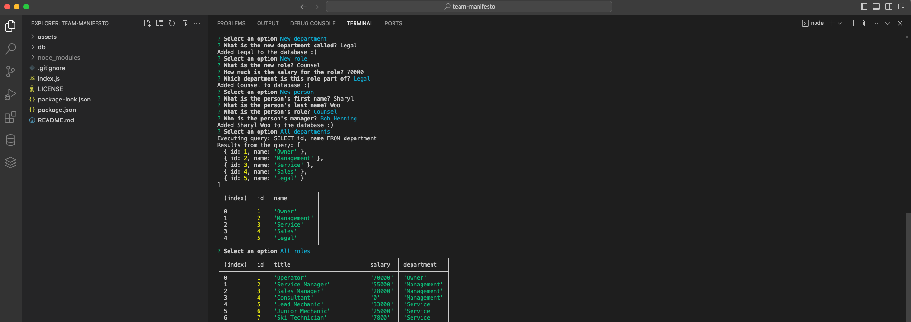

# team-manifesto

## Description

A simple content management system using mySQL as the database/model on the back-end, and using npm Inquirer for the front-end CLI interface. This project was meant to demonstrate usage of mySQL in combination with Node.js and Inquirer.

## Installation/Usage Demo Video

[Click here to watch the demo video]()

## Technologies

### mySQL
### Node.js
### JavaScript
### HTML
### CSS

## Credits & Sources

Information and documentation used in the creation of this app, but external to the EdX UofT Full-Stack Software Development Bootcamp including syntaxes, best practises and instructional examples for usage came from the following sources:
- https://www.npmjs.com/package/inquirer?activeTab=readme
- https://www.w3schools.com/MySQL/func_mysql_concat.asp
- https://www.w3schools.com/MySQL/mysql_join_left.asp
- https://www.w3schools.com/MySQL/mysql_select.asp
- https://www.w3schools.com/MySQL/mysql_insert.asp
- https://www.w3schools.com/MySQL/default.asp
- https://www.w3schools.com/js/js_switch.asp
- https://www.npmjs.com/package/mysql2

## License

See LICENSE file in repository

## Credits & Sources
- 